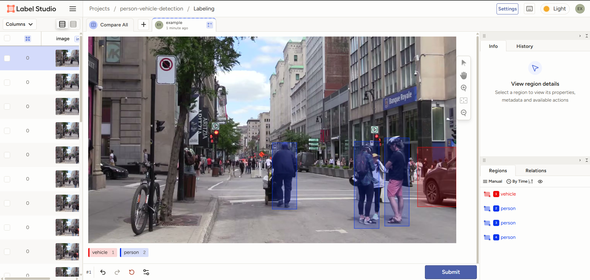

# Week 5 — Custom Dataset Creation, YOLO Training & Inference

## Overview
This week covered the complete pipeline: creating a labeled dataset from scratch, training YOLO26n on it, running inference on test images, and producing a final video with predictions.

---

## Task 04WT1# — YOLO Dataset Meta-Configuration Report

Explored YOLO26 dataset YAML files and label structures. Report in `week4/report.md`.

### Key Findings
| Component | Description |
|-----------|-------------|
| `dataset.yaml` | Defines `path`, `train`, `val`, `names`, `download` |
| `train.txt` / `val.txt` | Lists absolute paths to images |
| `labels/*.txt` | One file per image, each line: `<class_id> <x> <y> <w> <h>` (normalized) |
| `default.yaml` | Training hyperparameters (lr, optimizer, augmentations) |

---

## Task 04WT2# — Labeled Dataset Creation

### Video Source
- `output_1min.mp4` — ~60s, 1920×1080, 60fps, H.264
- Contains pedestrians and vehicles (real-world traffic scene)

### Frame Extraction
Extracted at **10fps** → **600 frames** total.

### Train/Val/Test Split
| Split | Count | Selection Strategy |
|-------|-------|--------------------|
| Train | 100 | Evenly spaced across timeline |
| Val | 40 | Evenly spaced from remaining |
| Test | 460 | All remaining frames |

### Annotation Classes
| Class ID | Name |
|----------|------|
| 0 | person |
| 1 | vehicle |

### Annotation Method
Used YOLO26n pretrained on COCO for auto-annotation:
- COCO class `0` (person) → class `0`
- COCO classes `2,3,5,7,8` (car, motorcycle, bus, truck, boat) → class `1`

### Dataset Structure (original)
```
dataset/
├── images/train/   (100 x 1920×1080)
├── images/val/     (40 x 1920×1080)
├── images/test/    (460 x 1920×1080)
├── labels/train/   (100 .txt, 1165 objects)
├── labels/val/     (40 .txt, 473 objects)
├── train.txt
├── val.txt
└── dataset.yaml
```

### Label Format
```
<class_id> <x_center> <y_center> <width> <height>
```
All coordinates normalized to [0,1]. Verified 1,778 bounding boxes — 0 errors.

---

## Task 05WT2# — Image Scaling

Images were scaled down to **384×216** (width=384, aspect ratio preserved) using OpenCV.

```
dataset_scaled/
├── images/train/   (100 x 384×216)
├── images/val/     (40 x 384×216)
├── images/test/    (460 x 384×216)
├── labels/train/   (100 .txt — unchanged, normalized coords still valid)
├── labels/val/     (40 .txt — unchanged)
├── train.txt
├── val.txt
└── dataset.yaml
```

---

## Task 05WT3# — YOLO26 Training

### Command
```bash
yolo train data=dataset_scaled/dataset.yaml model=yolo26n.pt epochs=100 imgsz=384 batch=16
```

### Training Progress
| Epoch | Train Box Loss | Train Cls Loss | Val Box Loss | Val Cls Loss | Precision | Recall | mAP50 |
|-------|---------------|---------------|-------------|-------------|-----------|--------|-------|
| 10 | 1.5225 | 1.6336 | 1.5748 | 2.4105 | 0.659 | 0.343 | 0.534 |
| 20 | 1.4803 | 1.3493 | 1.3125 | 1.3784 | 0.609 | 0.681 | 0.705 |
| 30 | 1.4190 | 1.1940 | 1.3047 | 1.2127 | 0.695 | 0.737 | 0.756 |
| 40 | 1.3887 | 1.0862 | 1.2190 | 1.0953 | 0.716 | 0.752 | 0.769 |
| 50 | 1.3184 | 1.0553 | 1.1816 | 1.0195 | 0.779 | 0.765 | 0.828 |
| 60 | 1.3211 | 0.9883 | 1.1587 | 1.0103 | 0.795 | 0.735 | 0.827 |

### Best Model — Epoch 52
| Metric | Value |
|--------|-------|
| Epoch | 52 |
| Precision | 0.806 |
| Recall | 0.765 |
| mAP50 | **0.843** |
| mAP50-95 | 0.661 |

### Observations
- Training loss consistently decreased across all epochs
- Validation loss plateaued around epoch 50 and began increasing slightly — early stopping triggered at epoch 61
- Best weights saved to `runs/detect/person_vehicle_detection/weights/best.pt` (20 MB)

---

## Task 05WT4# — Inference on Test Set

Ran the trained model (`best.pt`) on all **460 test images**.

### Results
- All 460 test images processed
- Annotated images saved to `runs/detect/person_vehicle_detection/test_predictions/`
- Each image shows bounding boxes with class labels (person / vehicle) and confidence scores

---

## Task 05WT5# — Final Video Production

### Pipeline
1. Stitched 460 annotated test images into video at **10fps**
2. Added audio track (`new_audio.mp3`) from week 3
3. Output: H.264 video + AAC audio

### Final Output
| Property | Value |
|----------|-------|
| File | `week5/person_vehicle_detection_inference.mp4` |
| Resolution | 384×216 |
| Frame Rate | 10 fps |
| Duration | 46 seconds |
| Size | ~9.3 MB |
| Codec | MPEG-4 + AAC |

---

## Annotation Screenshot



*Annotating person and vehicle bounding boxes using Label Studio.*

## Files

| File | Description |
|------|-------------|
| `week4/report.md` | 04WT1# report on dataset meta-configuration |
| `week5/best.pt` | Trained model weights (epoch 52, mAP50=0.843) |
| `week5/person_vehicle_detection_inference.mp4` | Final test prediction video with audio |
| `week5/README.md` | This file |
| `dataset/` | Original labeled dataset (1920×1080) |
| `dataset_scaled/` | Scaled dataset (384×216) with labels, YAML, train/val txts |
| `output_1min.mp4` | Source video for dataset |
